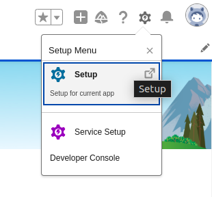
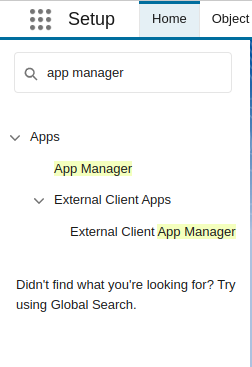
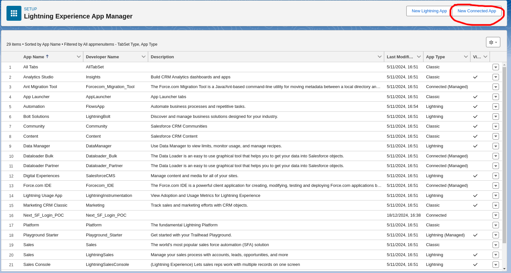
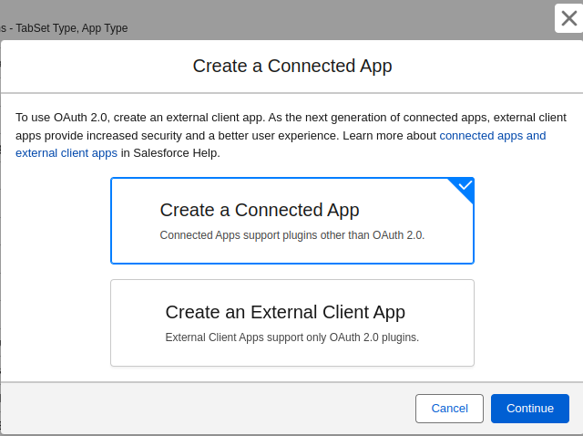
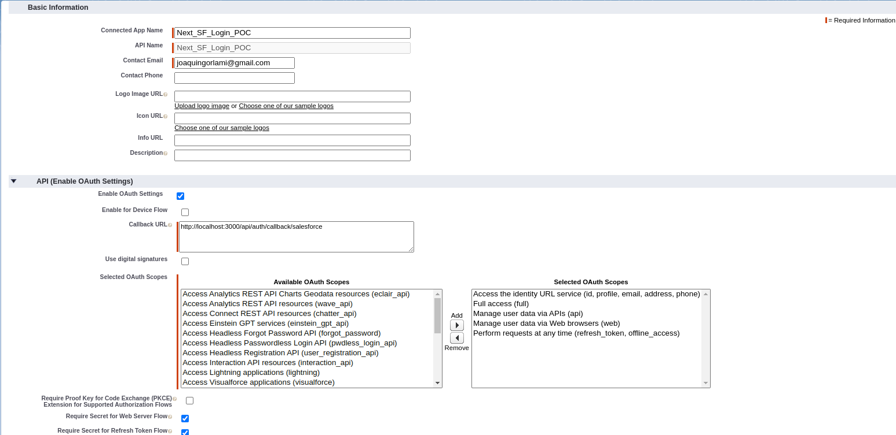
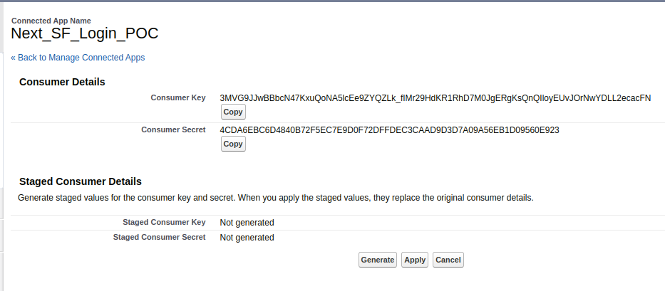

This is a [Next.js](https://nextjs.org) project bootstrapped with [`create-next-app`](https://nextjs.org/docs/app/api-reference/cli/create-next-app).

## Getting Started

First, run the development server:

-   Create a new `.env.local` file with the variables declared in the `env.example` file

Then run

```bash
npm run dev
# or
yarn dev
# or
pnpm dev
# or
bun dev
```

Open [http://localhost:3000](http://localhost:3000) with your browser to see the result.

You can start editing the page by modifying `app/page.tsx`. The page auto-updates as you edit the file.

This project uses [`next/font`](https://nextjs.org/docs/app/building-your-application/optimizing/fonts) to automatically optimize and load [Geist](https://vercel.com/font), a new font family for Vercel.

## Docker Image

Run

```bash
docker compose up --build
# or firstly
docker compose build
# and then
docker compose up
# once the image is built for the first time, it is not needed to be rebuilt to run it again
```

## Learn More

To learn more about Next.js, take a look at the following resources:

-   [Next.js Documentation](https://nextjs.org/docs) - learn about Next.js features and API.
-   [Learn Next.js](https://nextjs.org/learn) - an interactive Next.js tutorial.

You can check out [the Next.js GitHub repository](https://github.com/vercel/next.js) - your feedback and contributions are welcome!

## Deploy on Vercel

The easiest way to deploy your Next.js app is to use the [Vercel Platform](https://vercel.com/new?utm_medium=default-template&filter=next.js&utm_source=create-next-app&utm_campaign=create-next-app-readme) from the creators of Next.js.

Check out our [Next.js deployment documentation](https://nextjs.org/docs/app/building-your-application/deploying) for more details.

## Salesforce Configuration

-   Log into Your Sandbox or Dev Org

-   Click on the gear icon (⚙️) in the upper-right corner and select Setup.

    -   

    -   In the Quick Find box, type App Manager.
    -   Click on App Manager under Apps.
    -   
    -   Create a New Connected App

-   In the App Manager, click New Connected App in the upper-right corner.
-   -   
    -   Choose Create a Connected App
    -   

    -   Fill out the required fields:
    -   Connected App Name: Choose a name for your app.
    -   API Name: This will auto-populate based on the app name.
    -   Contact Email: Provide your email address.
    -   Enable OAuth Settings

-   Check the box for Enable OAuth Settings.

    -   Enter a Callback URL (e.g., http://localhost:3000/api/auth/callback/salesfoce).
    -   Select the appropriate OAuth Scopes (e.g., Access and manage your data (API) or Perform requests on your behalf at any time).
    -   Save and Configure
    -   

-   Save your connected app. Note that it may take a few minutes for the connected app to become available.
    -   After saving, you’ll see the Consumer Key and Consumer Secret, which are required for API authentication.
    -   
